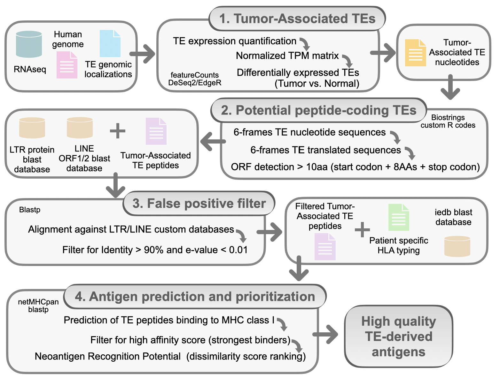

# ANTARES
The ANTigens from Repetitive ElementS (ANTARES) pipeline allows detecting high quality antigens derived from expressed tumor-associated transposable elements.

The pipeline consists in the following steps: 

**- 1.tumor_associated_TE.R**:
      TE expression is quantified in each tumor sample using featureCounts by enabling optimal parameters for counting reads mapping on repetitive genomic regions. Tumor specific TEs are filtered with differential analysis

2.
The second step of the workflow detects potential peptidecoding TE. Briefly, the nucleotide sequences of each tumor associated TE are formatted into 6 possible frames and only putative ORFs of at least 10 aminoacids from their translated sequences are retained.

3.
The third step reduces the number of false-positive TE-derived peptides by aligning their sequences against two pre-built databases of known proteins (one specific for LTR and one for LINE TE families) using Blastp. Only conserved sequences (identity > 90% and e-value < 0.01) are retained and considered as high-quality TE-derived peptides.

4.
In the last step of the workflow, putative antigens derived from the selected peptides are detected using netMHCpan and then prioritized both for MHC-I binding affinity and recognition potential scores.
